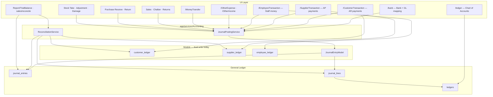

# Accounting System Master Plan

> **Purpose:** Single source of truth to make the Remote Center ERP accounting module **correct, reconcilable, and excellent UX** — phase by phase.  
> **Last updated:** June 2026  
> **Related docs:** [ACCOUNTING_SYSTEM_REDESIGN_PLAN.md](./ACCOUNTING_SYSTEM_REDESIGN_PLAN.md) (archived history), [ACCOUNTING_PROGRESS.md](./ACCOUNTING_PROGRESS.md) (changelog), [ACCOUNTING_USER_GUIDE.md](./ACCOUNTING_USER_GUIDE.md) (accountant guide), [ACCOUNTING_BACKUP_RESTORE.md](./ACCOUNTING_BACKUP_RESTORE.md) (ops)

---

## How to use this document

1. Work **one micro-phase at a time** (e.g. Phase 1A only).
2. Mark checkboxes when done; add date + PR/commit note in the changelog section at the bottom.
3. After each micro-phase, run the **Verification gate** for that phase before starting the next.
4. Do **not** skip Phase 0 (bug fixes) — bad CoA data poisons every journal.

---

## Definition of done (whole accounting system)

The accounting system is “perfect” for this ERP when all of the following are true:


| #   | Criterion                                                                                                                                        |
| --- | ------------------------------------------------------------------------------------------------------------------------------------------------ |
| 1   | **Every financial event** posts a balanced journal entry (Dr = Cr) through `JournalPostingService` or is explicitly documented as pre-GL legacy. |
| 2   | **Chart of Accounts** is validated, protected, and unambiguous (`ledger_nature` resolves to exactly one active system head per critical nature). |
| 3   | **Sub-ledgers** (customer, supplier, employee) reconcile to GL control accounts within tolerance.                                                |
| 4   | **Inventory / COGS** tie-out passes scheduled reconciliation (or drift is explained).                                                            |
| 5   | **Trial Balance** is accountant-grade (opening + period + closing).                                                                              |
| 6   | **General Ledger, P&L, Balance Sheet** are available with drill-down to source documents.                                                        |
| 7   | **Reversals** always create reversing journals; UI shows original + reversal lines.                                                              |
| 8   | **Audit trail** covers create / update / reverse for all money modules.                                                                          |
| 9   | **UX** is consistent across Accounting views (hub layout, filters, mobile cards, live preview where helpful).                                    |
| 10  | **Smoke tests + reconciliation cron** run clean on staging before production cutover.                                                            |


---

## Architecture (current)




### Core services


| Service                   | Path                                                | Role                                                                                                                                                |
| ------------------------- | --------------------------------------------------- | --------------------------------------------------------------------------------------------------------------------------------------------------- |
| **JournalPostingService** | `app/services/Accounting/JournalPostingService.php` | Central posting engine — all modules should call this. Resolves ledgers by `ledger_nature`, bank mappings, creates entries via `JournalEntryModel`. |
| **ReconciliationService** | `app/services/Accounting/ReconciliationService.php` | Compares sub-ledgers / stock / COGS to GL. Used by `sales/reconcile` UI and `database/scripts/run_gl_reconciliation.php`.                           |
| **JournalEntryModel**     | `app/models/JournalEntryModel.php`                  | Low-level `createEntry()`, `createReversingEntry()`, entry numbering.                                                                               |


---

## Module inventory — GL integration status

Legend: ✅ Live GL · ⚠️ Partial / gaps · ❌ Not integrated · 🔧 UX / logic debt

### Chart of Accounts & bank


| Module            | Routes / views                           | GL status | Notes                                                                  |
| ----------------- | ---------------------------------------- | --------- | ---------------------------------------------------------------------- |
| Chart of Accounts | `LedgerController`, `app/views/ledger/`* | 🔧        | Foundation is strong; known bugs in create/edit (see Phase 0).         |
| Bank accounts     | `BankController`, `app/views/bank/*`     | ✅         | `bank_ledger_mappings` links bank → GL cash/bank head. Has `show` hub. |


### Entity-wise transactions (Accounting folder)

These modules maintain **operational sub-ledgers** AND post to GL via `JournalPostingService`.


| Module       | Controller / model                                           | Transaction types                                                   | GL methods                                                                | Sub-ledger        | Details UI shows JE                 |
| ------------ | ------------------------------------------------------------ | ------------------------------------------------------------------- | ------------------------------------------------------------------------- | ----------------- | ----------------------------------- |
| **Customer** | `CustomerTransactionController` / `CustomerTransactionModel` | `receive`, `payment`, `discount`, `write_off`                       | `postCustomerTransactionJournal()` → payment, refund, discount, write-off | `customer_ledger` | ✅ `Accounting/customer/details.php` |
| **Supplier** | `SupplierTransactionController` / `SupplierTransactionModel` | `payment`, `advance`, `receive`                                     | `postSupplierTransactionJournal()`                                        | `supplier_ledger` | ✅ `Accounting/supplier/details.php` |
| **Employee** | `EmployeeTransactionController` / `EmployeeTransactionModel` | `advance`, `loan`, `repayment`, `salary`, `deduction`, `adjustment` | `postEmployeeTransactionJournal()`                                        | `employee_ledger` | ✅ `Accounting/employee/details.php` |


**Important:** Purchase GRN creates supplier **payable** in GL (`postPurchaseReceive`) but day-to-day supplier **payments** go through `SupplierTransaction` — both must reconcile to the same AP control head (`supplier_payable` nature).

### Voucher-style accounting modules


| Module         | GL `reference_type` | `journal_entry_id` on source | Reversal       |
| -------------- | ------------------- | ---------------------------- | -------------- |
| Other Expense  | `other_expense`     | ✅                            | ✅ Reversing JE |
| Other Income   | `other_income`      | ✅                            | ✅ Reversing JE |
| Money Transfer | `money_transfer`    | ✅ (verify on all envs)       | ✅ Reversing JE |


### Sales chain


| Event                    | GL method                           | `reference_type`           | Linked column                        |
| ------------------------ | ----------------------------------- | -------------------------- | ------------------------------------ |
| Invoice finalized        | `postSalesInvoice()`                | `sales_invoice`            | `sales_invoices.journal_entry_id`    |
| Invoice total adjustment | `postSalesInvoiceTotalAdjustment()` | `sales_invoice_adjustment` | —                                    |
| Challan dispatch / COGS  | `postSalesChallanCOGS()`            | `sales_challan`            | `sales_challans.journal_entry_id`    |
| Customer payment (POS)   | `postCustomerPayment()`             | `customer_payment`         | `customer_payments.journal_entry_id` |
| Sales return confirmed   | `postSalesReturn()`                 | `sales_return`             | `sales_returns.journal_entry_id`     |


### Purchase & stock


| Event               | GL method                | Status |
| ------------------- | ------------------------ | ------ |
| GRN receive         | `postPurchaseReceive()`  | ✅      |
| Purchase return     | `postPurchaseReturn()`   | ✅      |
| Stock take variance | `postStockTakeSession()` | ✅      |
| Stock adjustment    | `postStockAdjustment()`  | ✅      |
| Damage write-off    | `postDamage()`           | ✅      |


### Inter-branch


| Event                            | GL method                            | Status |
| -------------------------------- | ------------------------------------ | ------ |
| Branch demand fulfillment        | `postBranchDemandFulfillment()`      | ✅      |
| Branch demand settlement         | `postBranchDemandSettlement()`       | ✅      |
| Warehouse transfer (interbranch) | `postWarehouseTransferInterbranch()` | ✅      |
| Interbranch stock movement       | `postInterbranchStockMovement()`     | ✅      |


### Not built yet


| Capability                               | Status                                 |
| ---------------------------------------- | -------------------------------------- |
| Manual journal entry UI                  | ❌                                      |
| General Ledger report (per account)      | ❌                                      |
| Profit & Loss                            | ✅                                      |
| Balance Sheet                            | ✅                                      |
| Period close / lock dates                | ❌                                      |
| AP sub-ledger vs GL reconciliation       | ❌ (AR only in `ReconciliationService`) |
| Employee sub-ledger vs GL reconciliation | ❌                                      |


---

## Known bugs & technical debt register

Fix these in **Phase 0** before new features.

### Chart of Accounts (`app/views/ledger`)


| ID   | Severity     | Issue                                                                              | Location                               |
| ---- | ------------ | ---------------------------------------------------------------------------------- | -------------------------------------- |
| L-01 | **Critical** | Scenario cards 2–10: missing `>` on opening `<div>` — broken HTML, clicks fail     | `create.php` lines ~51–137             |
| L-02 | **Critical** | Edit form: `ledger_nature` not pre-selected — risk of clearing nature on save      | `edit.php` nature `<select>`           |
| L-03 | **High**     | `createLedger()` ignores `description` and `is_active` from POST                   | `LedgerModel::createLedger()`          |
| L-04 | **High**     | No server validation: `account_type` ↔ `ledger_nature` ↔ `normal_balance`          | `LedgerModel` + controller             |
| L-05 | **High**     | Duplicate `ledger_nature` allowed — `getLedgerByNature()` picks first row silently | `LedgerModel`, `JournalPostingService` |
| L-06 | **Medium**   | Deactivate allowed even when `journal_lines > 0` or sole nature head               | `toggleStatus()`                       |
| L-07 | **Medium**   | Toggle via GET `/ledger/toggle/{id}` — no CSRF                                     | `LedgerController`, `index.php` JS     |
| L-08 | **Medium**   | Ledger code `COUNT+1` — not collision-safe                                         | `generateLedgerCode()`                 |
| L-09 | **Low**      | Scenario explanation JS targets `.card.border-primary` but card uses inline border | `create.php` JS                        |
| L-10 | **Low**      | Index nature filter lists ~8 values; create form has ~22                           | `index.php` filters                    |
| L-11 | **UX**       | No `ledger/show` hub (balance, recent JEs) unlike `bank/show`                      | missing view                           |
| L-12 | **UX**       | System ledger edit shows editable fields but save fully disabled                   | `edit.php`                             |


### Cross-module


| ID   | Issue                                                                                                           |
| ---- | --------------------------------------------------------------------------------------------------------------- |
| X-01 | `ACCOUNTING_SYSTEM_REDESIGN_PLAN.md` understates Sales/Purchase GL progress — keep docs in sync with this plan. |
| X-02 | `ReconciliationService` covers AR, inventory, COGS — not AP or employee payable.                                |
| X-03 | Trial Balance is period-activity only — no opening/closing balances.                                            |
| X-04 | No unified “Accounting home” navigation — modules scattered in menu.                                            |
| X-05 | `entity_type` / `entity_id` on `journal_lines` populated inconsistently across posting methods.                 |
| X-06 | Historical records may exist without `journal_entry_id` — backfill strategy undefined.                          |


---

## Design principles (for all future work)

1. **Single posting path** — Business models call `JournalPostingService`; never flip cash/bank balances without a journal (except documented legacy fallback).
2. **Nature is the contract** — Automated posting keys off `ledger_nature`, not ledger name. One active system head per critical nature.
3. **Dual write with reconciliation** — Keep sub-ledgers for UX/speed; GL is truth for financial statements; reconcile regularly.
4. **Atomic transactions** — DB transaction wraps: source row + sub-ledger + journal + `journal_entry_id` update.
5. **Reversal = reversing JE** — No silent deletes; link via `reversal_of_entry_id`.
6. **Show the journal** — Every money detail page displays JE number + Dr/Cr lines (customer/supplier/employee already do — extend pattern everywhere).
7. **Hub UX consistency** — Hero, stats, filters, DataTables, mobile cards, audit link, CSRF on mutations (match `branch`, `bank`, `OtherExpense` patterns).
8. **Branch scope** — Respect `sessionBranchId()`; reconciliation and reports filter correctly.
9. **Fail loud** — If journal posting fails, roll back the whole business transaction with a clear error message.
10. **Verify before ship** — Trial balance + reconciliation script + module smoke test for each phase.

---

## Phased roadmap

Each **letter** is a small, reviewable unit of work (typically 1–3 dev sessions). Complete verification before moving on.

---

### Phase 0 — Stabilize Chart of Accounts (must do first)

#### Phase 0A — Fix ledger UI bugs

- [x] Fix scenario card HTML (`>`) on cards 2–10 in `app/views/ledger/create.php`
- [x] Fix scenario explanation selector (use stable ID, not `.border-primary`)
- [x] Pre-select `ledger_nature`, `control_account_type`, `normal_balance` on edit form
- [x] Pre-select current values for all edit dropdowns / radios consistently

**Verify:** Create via each scenario card; edit existing user ledger — nature displays correctly; save does not blank fields.

#### Phase 0B — Fix ledger persistence & validation

- [x] Persist `description` and `is_active` in `LedgerModel::createLedger()`
- [x] Add `LedgerModel::validateLedgerPayload()` — type / nature / normal balance matrix
- [x] Reject create/update when combo is invalid (friendly error messages)
- [x] Auto-set `normal_balance` from `account_type` when omitted (server-side backup to UI)

**Verify:** Submit create with description; invalid combo rejected with clear message.

#### Phase 0C — Protect posting integrity

- [x] Enforce **one active ledger per critical nature** (`customer_receivable`, `supplier_payable`, `cash_bank`, `inventory`, `sales_revenue`, `cogs`, `employee_payable`) OR explicit `is_primary` flag
- [x] Block deactivate when `journal_lines` count > 0
- [x] Block deactivate when account is the only active row for its nature
- [x] Improve `generateLedgerCode()` (max code + 1 or sequence table)

**Verify:** Cannot create second `customer_receivable`; cannot deactivate COGS head with journal history.

#### Phase 0D — Secure status changes

- [x] Change toggle to POST with CSRF (form or fetch from index)
- [x] Return JSON for AJAX toggle optional; keep redirect fallback
- [x] Log toggle details in audit (`ledger_status_changed` with old/new status)

**Verify:** Toggle works only via POST; CSRF rejected without token.

---

### Phase 1 — Chart of Accounts as a workspace

#### Phase 1A — Ledger show hub

- [x] Add `LedgerController::show($id)` + `app/views/ledger/show.php`
- [x] Display: code, type, nature, flags, parent, description
- [x] GL balance (net from `journal_lines`, respect normal balance side)
- [x] Last 20 journal lines for this ledger
- [x] Links: Edit, Trial Balance filtered, related bank mappings if `cash_bank`

**Verify:** Open system AR head — balance matches reconciliation AR GL figure.

#### Phase 1B — Index & hierarchy UX

- [x] Expand nature filter to full nature list (grouped or searchable)
- [x] Add optional tree / indented view (parent → child via `parent_id`, `sort_order`)
- [x] Align parent picker: create + edit use same hierarchical dropdown
- [x] Link account name in index → `ledger/show`

**Verify:** Filter by `payroll_expense`; sub-account under parent displays indented.

#### Phase 1C — System ledger metadata

- [x] Allow **description-only** update on system ledgers (server + UI)
- [x] Keep type/nature/normal_balance locked
- [x] Audit log metadata-only changes

**Verify:** Update description on `Sales Revenue` system head; type unchanged.

#### Phase 1D — Ledger audit upgrade

- [x] Show user **name** not only `#id` in audit table
- [x] Rename confusing column label (`target_user_id` → Ledger ID in UI)
- [x] Richer audit details on create/update (type, nature, flags diff)

**Verify:** Create ledger — audit row shows meaningful detail.

---

### Phase 2 — Reporting foundation

#### Phase 2A — Trial Balance v2

- [x] Add opening balance column (sum JE before `from_date`)
- [x] Add period debit/credit (existing)
- [x] Add closing balance column
- [x] Toggle “Include zero-balance accounts”
- [x] Click ledger row → General Ledger report (Phase 2B) or `ledger/show`

**Verify:** One account with prior-month activity shows correct opening.

#### Phase 2B — General Ledger report

- [x] New report: `Report/GeneralLedger` + `GeneralLedgerReport.php`
- [x] Filters: ledger, date range, branch
- [x] Columns: date, JE no, reference type/id, narration, Dr, Cr, running balance
- [x] Link reference to source module (invoice, payment, etc.)
- [x] CSV export

**Verify:** GL for AR control matches sum of customer sub-ledger movements + invoice JEs.

#### Phase 2C — Journal entry listing

- [x] New report: `Report/JournalEntries` — searchable list of all JEs in range
- [x] Filters: reference_type, branch, reversed yes/no, user
- [x] Detail expand: all lines
- [x] Export

**Verify:** Filter `reference_type=customer_payment` — matches customer transaction list count.

#### Phase 2D — Reusable journal partial

- [x] Extract shared partial `app/views/partials/journal_entry_card.php`
- [x] Use in: customer/supplier/employee details, OtherExpense/Income details, MoneyTransfer, **ledger/show** (links)
- [x] Consistent formatting: entry_no, date, reversed badge, lines table

**Verify:** Same JE card appearance on customer payment and other expense detail.

---

### Phase 3 — Entity transactions polish (Customer · Supplier · Employee)

These modules already post to GL. This phase makes them **error-free and awesome**, aligned with Other Expense UX.

#### Phase 3A — Customer transactions

- [x] Audit index/create UX vs OtherExpense standard (hero, stats, filters, mobile)
- [x] Live double-entry preview on create (receive / payment / discount / write-off)
- [x] Ensure `discount` and `write_off` post correct expense/contra heads (review `postCustomerDiscount`, `postCustomerWriteOff`)
- [x] Details: link JE card to Journal Entry report
- [x] Reversal UX: SweetAlert + audit reason (match OtherExpense pattern)
- [x] Index: “Show reversed” mode if not present

**Verify:** Receive Tk 1000 → Dr Bank/Cr AR; reverse → net zero in TB.

#### Phase 3B — Supplier transactions

- [x] Same UX pass as 3A for `payment`, `advance`, `receive`
- [x] Live preview: payment/advance = Dr AP / Cr Cash; receive = Dr Cash / Cr AP
- [x] Confirm GRN AP + payment AP both hit same control ledger in TB
- [x] Reversal + audit parity
- [x] Details JE partial from Phase 2D

**Verify:** Pay supplier → AP credit; GRN → AP debit; net payable matches supplier sub-ledger.

#### Phase 3C — Employee transactions

- [x] Confirm migration `042_employee_transaction_journal_entry_id.sql` (idempotent; replaces legacy `add_employee_transaction_journal_entry_id.sql`)
- [x] UX pass: index/create/details match customer module
- [x] Live preview for salary/advance/loan vs repayment/deduction
- [x] Validate `employee_payable` system ledger exists and is unique (create-form banner)
- [x] Reversal + audit parity

**Verify:** Salary outflow → Dr employee_payable / Cr cash; repayment reverses direction.

**Out of scope (future HR phase):** Attendance-based salary sheets, late deductions, automated loan/advance recovery workflows — those will post through the same `employee_payable` control account when built.

#### Phase 3D — Entity transaction shared improvements

- [x] Shared JS module for accounting preview (`public/assets/js/accounting-journal-preview.js`)
- [x] Shared CSS consolidated in `entity-voucher-slip-print.css` + GL preview styles in `accounting-money-flow.css`
- [x] Standard voucher slip print layout across customer/supplier/employee
- [x] Route role review: accountant vs manager permissions consistent (supplier/employee identical; customer salesman read/create only)

**Verify:** All three modules look and behave like one product family.

---

### Phase 4 — Reconciliation & integrity dashboard

#### Phase 4A — Extend ReconciliationService

- [x] Add **AP section**: `supplier_ledger` net vs GL `supplier_payable`
- [x] Add **Employee section**: `employee_ledger` net vs GL `employee_payable`
- [x] Add **Cash/Bank section**: sum bank balances vs GL `cash_bank` (+ mappings)
- [x] Include mismatch detail rows (top 20 parties off tolerance)

**Verify:** `run_gl_reconciliation.php` prints AR + AP + Employee + Inventory + COGS.

#### Phase 4B — Reconciliation UI upgrade

- [x] Upgrade `sales/reconcile` → **Accounting/Reconciliation** hub (`Reconciliation/index`, alias `Accounting/Reconciliation`; legacy `sales/reconcile` still resolves)
- [x] Branch + date filters; traffic-light cards per section
- [x] Drill-down links to problem customers/suppliers/employees (and banks)
- [x] Document tolerance config (`GL_RECONCILIATION_TOLERANCE`) in UI callout + master plan

**Verify:** UI matches CLI script results for same branch/date (`run_gl_reconciliation.php --branch=… --from=… --to=…`).

#### Phase 4C — Scheduled monitoring & Telegram alerts

- [x] Migration `043_users_telegram_user_id.sql` — per-user Telegram chat id on `users`
- [x] Reusable `core/Telegram.php` + `TelegramNotificationService` + `SalesTelegramNotifier`
- [x] Sales alert matrix (see `docs/TELEGRAM_ALERTS.md`):
  - Invoice created → branch warehouse managers
  - Challan finalized → salesman, sales-by, warehouse managers
  - Return created → admin
  - Return received → admin, warehouse managers, receiver
  - Today-invoice payment → admin, accountant
- [x] Self-service Telegram ID on `user/two_factor`; admin edit on `user/edit`
- [x] Cron doc in this file + `ACCOUNTING_BACKUP_RESTORE.md`
- [x] Alert log review workflow (`logs/reconciliation_alerts.log`)
- [x] Reconciliation Telegram hook on `has_issues`

**Verify:** Each sales event above sends to the correct roles when `telegram_user_id` is set; failures never block the business transaction. Cron exit code 1 when reconciliation has issues; Telegram + log written; UI shows recent log on `sales/reconcile`.

**Setup:** `TELEGRAM_BOT_TOKEN` in `config/local.php`; implementation guide in `docs/TELEGRAM_ALERTS.md`.

##### Scheduled jobs (cron / Task Scheduler)

Run from project root (`C:\xampp\htdocs\remote-center-erp` or server deploy path). Use the same PHP binary as the web app (e.g. `C:\xampp\php\php.exe` on XAMPP).


| Job                     | Command                                              | Suggested schedule             | Exit / alerts                                                                                                 |
| ----------------------- | ---------------------------------------------------- | ------------------------------ | ------------------------------------------------------------------------------------------------------------- |
| **GL reconciliation**   | `php database/scripts/run_gl_reconciliation.php`     | Daily after close (e.g. 23:30) | Exit **1** if any branch `has_issues`; writes `logs/reconciliation_alerts.log`; Telegram → admin + accountant |
| **Stale draft cleanup** | `php database/scripts/cancel_stale_sales_drafts.php` | Weekly (e.g. Sunday 02:00)     | Cancels drafts older than `SALES_STALE_DRAFT_DAYS` (default 14)                                               |
| **Accounting backup**   | `php database/scripts/backup_accounting_core.php`    | Weekly + before migrations     | SQL dump of GL / AR core tables                                                                               |


Optional flags for reconciliation:

```bash
php database/scripts/run_gl_reconciliation.php --branch=1 --from=2026-06-01 --to=2026-06-19
```

**Windows Task Scheduler:** Action → Start a program → Program: `C:\xampp\php\php.exe`, Arguments: `database\scripts\run_gl_reconciliation.php`, Start in: project root.

**Linux cron example:**

```cron
30 23 * * * cd /var/www/remote-center-erp && php database/scripts/run_gl_reconciliation.php >> logs/cron_reconciliation.log 2>&1
0  2 * * 0 cd /var/www/remote-center-erp && php database/scripts/cancel_stale_sales_drafts.php >> logs/cron_stale_drafts.log 2>&1
0  3 * * 0 cd /var/www/remote-center-erp && php database/scripts/backup_accounting_core.php /backups/remote-center-erp >> logs/cron_backup.log 2>&1
```

##### Alert log review workflow

1. **Automated:** Cron runs `run_gl_reconciliation.php` → issues append JSON lines to `logs/reconciliation_alerts.log` and trigger Telegram (if bot configured).
2. **In-app:** Open **Sales → GL Reconciliation** (`sales/reconcile`) — **Recent alert log** table (last 25 entries).
3. **CLI:** `php database/scripts/review_reconciliation_alerts.php --limit=50 --since=2026-06-01`
4. **Triage:** Match log branch/issues to reconcile UI sections (AR, inventory, COGS); fix data or post correcting journals; re-run cron until exit 0.
5. **Sales audit failures** also append to the same log via `ReconciliationService::notifyAuditFailures()` (optional email via `RECON_ALERT_EMAIL`).

Config (optional, `config/local.php`):

```php
define('GL_RECONCILIATION_TOLERANCE', 0.02);
define('RECON_ALERT_EMAIL', 'finance@yourcompany.com');
define('TELEGRAM_BOT_TOKEN', '...');
define('TELEGRAM_ALERTS_ENABLED', true);
```

---

### Phase 5 — Operational modules audit surfaces

#### Phase 5A — Sales GL audit completeness

- [x] `SalesAudit` checklist covers all JE link columns
- [x] Invoice/challan/return detail shows linked JE (partial from 2D)
- [x] `sales/reconcile` linked from ledger index quick nav (already partially there)

**Verify:** Full sales cycle smoke test from `ACCOUNTING_PROGRESS.md` checklist — TB balanced.

**Surfaces:** `sales/show/{id}`, `challan/details/{id}`, `SalesReturn/details/{id}`, `SalesAudit/checklist` — journal cards via `SalesGlAuditHelper` + `partials/sales_gl_journal_blocks.php`.

#### Phase 5B — Purchase GL audit

- [x] Purchase receive/return detail pages show JE card
- [x] Purchase audit module (mirror SalesAudit) or extend existing `PurchaseAudit`
- [x] Reversal flows show reversing JE

**Verify:** GRN → Dr Inventory / Cr AP; return reverses.

**Surfaces:** `PurchaseReceive/details/{id}`, `PurchaseReturn/details/{id}`, `PurchaseAudit/checklist` — journal cards via `PurchaseGlAuditHelper` + shared `partials/sales_gl_journal_blocks.php`.

#### Phase 5C — Stock modules GL audit

- [x] Stock take / adjustment / damage detail → JE card
- [x] Confirm shrinkage/surplus nature ledgers exist (migration 024)

**Verify:** Stock take shortage posts to `inventory_shrinkage` nature.

**Surfaces:** `StockTake/details/{id}`, `StockAdjustment/details/{id}`, `Damage/details/{id}`, `StockTake/checklist`, `StockAdjustment/checklist` — journal cards via `StockGlAuditHelper` + shared `partials/sales_gl_journal_blocks.php`.

#### Phase 5D — Inter-branch GL

- [x] Branch demand / warehouse transfer detail shows JE when posted
- [x] Reconcile interbranch receivable/payable nature heads exist in CoA seed

**Verify:** Interbranch movement creates balanced JE; TB still balances.

**Surfaces:** `BranchDemand/details/{id}`, `WarehouseTransfer/details/{id}`, `BranchDemand/checklist` — journal cards via `InterbranchGlAuditHelper` + shared `partials/sales_gl_journal_blocks.php`. CoA checks in `BranchIntercompanyAuditModel` (migration 021).

---

### Phase 6 — Manual journals & period control

#### Phase 6A — Manual journal entry

- [x] `ManualJournalController` + create/list views
- [x] Multi-line form with live balance check (Dr = Cr)
- [x] Post via `JournalEntryModel` (`reference_type = manual`)
- [x] Restrict to admin/accountant; full audit log
- [x] Optional attachment/note field

**Verify:** Manual adjustment balances; appears in GL report and TB. Run `php database/scripts/apply_migration_044.php` once before first use.

**Surfaces:** `ManualJournal`, `ManualJournal/create`, `ManualJournal/details/{id}`, `ManualJournal/audit` · migration `044_manual_journals.sql`

#### Phase 6B — Period close (soft lock)

- [x] `accounting_periods` table with `closed_through_date` per branch
- [x] Block posting/backdating before close date (`JournalEntryModel` + document models)
- [x] Configurable override: superadmin always; admin when `PERIOD_CLOSE_ADMIN_OVERRIDE`
- [x] UI indicator banner on accounting modules + period close admin UI

**Verify:** Cannot post expense dated before closed period (except superadmin / admin override). Run `php database/scripts/apply_migration_045.php` once.

**Surfaces:** `AccountingPeriod/index` · banner on ledger, vouchers, manual journal, reconciliation

#### Phase 6C — Year-end checklist (documentation + UI)

- [x] Pre-close checklist: TB balanced, reconciliation green, backup taken
- [x] Export TB + GL archive for year (CSV)
- [x] Period close blocked when reconciliation or TB fails (same gate as checklist)

**Verify:** Run `AccountingPeriod/year_end` — failing reconciliation blocks banner and `AccountingPeriod/close`. Export TB + GL archive links on checklist.

**Surfaces:** `AccountingPeriod/year_end`, `AccountingPeriod/export_year_tb`, `AccountingPeriod/export_year_gl` · gate in `AccountingPeriodService::closePeriod`

---

### Phase 7 — Financial statements

#### Phase 7A — Profit & Loss

- [x] `Report/ProfitAndLoss` — Income − Expense for date range
- [x] Map `ledger_nature` groups (sales_revenue, cogs, operating_expense, payroll, etc.)
- [x] Branch filter; comparative period optional
- [x] Export CSV/PDF (CSV download + print-ready PDF HTML)

**Verify:** Net profit = total income − total expense; gross profit = revenue − COGS. Run `database/tests/profit_and_loss_smoke.php`.

**Surfaces:** `Report/ProfitAndLoss` · `ProfitAndLossReport` · Reports hub + ledger quick nav

#### Phase 7B — Balance Sheet

- [x] `Report/BalanceSheet` as of date
- [x] Assets = Liabilities + Equity check with clear diff banner
- [x] Use normal_balance for sign presentation

**Verify:** When cumulative TB is balanced, BS equation difference should be zero (Income/Expense rolled into equity).

**Surfaces:** `Report/BalanceSheet` · `BalanceSheetReport` · Reports hub + ledger quick nav

#### Phase 7C — Cash flow (optional)

- [x] Simple indirect cash flow from GL cash/bank movements
- [x] Net profit + depreciation + working-capital changes; investing & financing sections
- [x] Reconciliation banner: statement vs GL cash_bank movement; bank register vs GL closing

**Verify:** Run `database/tests/cash_flow_smoke.php` — GL opening + movement = closing; bank register ≈ GL cash_bank (all branches).

**Surfaces:** `Report/CashFlow` · `CashFlowReport` · Reports hub + ledger quick nav

#### Phase 7D — Enhanced aging reports

- [x] Tie `PayableAging` / `ReceivableAging` to GL control balances footnote
- [x] Cross-link to supplier/customer transaction modules + Reconciliation hub

**Verify:** Run `database/tests/aging_footnote_smoke.php` — aging total ≈ sub-ledger total.

**Surfaces:** `Report/PayableAging`, `Report/ReceivableAging` · `AgingReportHelper`

---

### Phase 8 — UX unification & accounting home

#### Phase 8A — Accounting dashboard

- [x] Hub: `/Accounting/index` with health widgets + dashboard widget on main dashboard for finance roles
- [x] Tiles: TB status (MTD balanced/out of balance), reconciliation traffic lights (6 sections), quick link grid
- [x] Recent journal activity feed (branch-scoped, source links)

**Verify:** Accountant lands one page to see system health.

#### Phase 8B — Navigation & menu

- [x] Menu group: **Accounting** with logical sub-order (`AccountingNavHelper`, sidebar partial)
- [x] Breadcrumbs on all accounting views (`main.php` + `accounting_breadcrumb.php`)
- [x] Quick nav consistent across accounting index pages (operational links only; reports → Reports hub)
- [x] Audit/checklist reports moved to `ReportsCatalog` ops category (`#cat-ops`, `#cat-finance`)

**Verify:** All accounting modules reachable in ≤2 clicks from hub (`Accounting/index` tiles + sidebar).

#### Phase 8C — Mobile & accessibility

- [x] Mobile card views on accounting index pages (`acct-mobile-card`, shared CSS; ManualJournal + dashboard feed added)
- [x] Touch-friendly filters at 375px (`acct-touch-filters`, collapsible `<details>`, 44px targets, proper `<label for>`)
- [x] Form labels / ARIA on critical money forms (customer/supplier/employee payments, vouchers, manual journal)

**Verify:** Customer payment index usable on phone.

#### Phase 8D — Documentation sync

- [x] Update `ACCOUNTING_SYSTEM_REDESIGN_PLAN.md` — superseded banner + pointer to master plan
- [x] Keep `ACCOUNTING_PROGRESS.md` as release changelog (synced with master plan table)
- [x] Accountant user guide — `docs/ACCOUNTING_USER_GUIDE.md` + in-app `/Accounting/guide`

**Verify:** New developer reads only master plan + progress to understand state.

---

### Phase 9 — Data migration & production hardening

#### Phase 9A — Historical backfill policy

- [ ] Decide: backfill JEs for old rows vs cutover date only
- [ ] Scripts per module (pattern: `database/scripts/backfill_*.php`)
- [ ] Log un-backfillable rows

**Verify:** Post-backfill TB balanced for cutover month.

#### Phase 9B — Legacy path removal

- [ ] List modules still updating cash/bank without journal (grep audit)
- [ ] Remove or gate behind “legacy mode” flag
- [ ] Deprecation timeline

**Verify:** No new rows without `journal_entry_id` on integrated modules.

#### Phase 9C — Automated testing

- [ ] Expand `database/tests/sales_core_smoke.php`
- [ ] Add `accounting_core_smoke.php`: CoA, voucher, customer payment, TB
- [ ] CI or pre-deploy script runs smoke + reconciliation

**Verify:** Smoke passes on clean staging DB.

#### Phase 9D — Backup & disaster recovery drill

- [ ] Follow `ACCOUNTING_BACKUP_RESTORE.md` on staging annually
- [ ] Document RTO/RPO for accounting tables

**Verify:** Restore + reconciliation passes within tolerance.

---

## Verification gates (quick reference)


| After phase | Run                                                             |
| ----------- | --------------------------------------------------------------- |
| 0           | Manual CoA create/edit/toggle; no invalid nature combos         |
| 1           | `ledger/show` balance vs manual SQL sum of `journal_lines`      |
| 2           | Trial Balance + GL report export for test month                 |
| 3           | Customer + supplier + employee payment cycle each reversed once |
| 4           | `php database/scripts/run_gl_reconciliation.php` — all OK       |
| 5           | Sales + purchase + stock smoke tests                            |
| 6           | Manual JE + period lock attempt                                 |
| 7           | P&L + BS tie to TB                                              |
| 8           | UX walkthrough with accountant user                             |
| 9           | Full backup/restore drill                                       |


### Standard smoke commands

```bash
php database/tests/sales_core_smoke.php
php database/tests/stock_availability_smoke.php
php database/scripts/run_gl_reconciliation.php
php database/scripts/backup_accounting_core.php
```

---

## Critical `ledger_nature` heads (must exist & be unique)


| Nature                                           | Used by                                   |
| ------------------------------------------------ | ----------------------------------------- |
| `customer_receivable`                            | Sales invoice, customer payments, returns |
| `supplier_payable`                               | GRN, purchase return, supplier payments   |
| `employee_payable`                               | Employee transactions                     |
| `cash_bank`                                      | All cash/bank movements (+ bank mappings) |
| `inventory`                                      | GRN, challan COGS, returns, stock modules |
| `cogs`                                           | Challan issue, returns, shrinkage         |
| `sales_revenue`                                  | Sales invoice                             |
| `sales_return`                                   | Sales return                              |
| `sales_discount`                                 | Invoice discounts (optional)              |
| `inventory_shrinkage`                            | Stock take/adjustment shortage            |
| `inventory_surplus`                              | Stock take/adjustment overage             |
| `interbranch_receivable` / `interbranch_payable` | Branch demand / transfers                 |


Seed / migration sources: `database/migrations/001_create_accounting_core_tables.sql`, `019_gl_control_bank_mapping.sql`, `024_stock_take_phase3_gl.sql`, `add_employee_payable_ledger.sql`.

---

## Suggested work order (priority)

```
Phase 0 (all) → Phase 1 → Phase 2 → Phase 3 → Phase 4 → Phase 5 → Phase 6 → Phase 7 → Phase 8 → Phase 9
```

**Rationale:** Fix CoA data first → visibility (GL report) → polish entity transactions users touch daily → reconciliation trust → audit surfaces → manual/period tools → financial statements → UX hub → production hardening.

---

## Changelog (mark completed phases here)


| Date       | Phase   | Notes                                                                                                            |
| ---------- | ------- | ---------------------------------------------------------------------------------------------------------------- |
| 2026-06-19 | 0A–0D   | CoA bug fixes, validation, deactivation guards, POST+CSRF toggle                                                 |
| 2026-06-19 | 1A–1D   | Ledger show hub, hierarchy UX, system description edit, audit upgrade                                            |
| 2026-06-19 | 2A–2D   | TB v2 (opening/closing), General Ledger & Journal Entries reports, shared JE partial                             |
| 2026-06-19 | 3A      | Customer payments UX parity, GL preview, discount/write-off heads, reversed mode, audit                          |
| 2026-06-19 | 3B      | Supplier payments UX parity, GL preview, AP control verified, reversed mode, audit                               |
| 2026-06-19 | 3C      | Employee transactions UX parity, GL preview, employee_payable validation, reversed mode, audit                   |
| 2026-06-19 | 3D      | Shared GL preview JS, entity voucher slip CSS, employee slip parity, route role matrix documented                |
| 2026-06-19 | 4C      | Telegram bot alerts: migration 043, Telegram service, challan finalize → branch warehouse managers               |
| 2026-06-19 | 4C+     | Sales Telegram matrix (5 events) + `docs/TELEGRAM_ALERTS.md` implementation guide                                |
| 2026-06-19 | 4C done | Cron docs, reconciliation alert log UI/CLI, GL recon Telegram → admin/accountant                                 |
| 2026-06-19 | 4A      | ReconciliationService: AP, employee, cash/bank sections + top-20 party/bank mismatches                           |
| 2026-06-19 | 4B      | Reconciliation hub UI: branch/date filters, traffic-light sections, entity drill-down, tolerance docs            |
| 2026-06-19 | 6A      | Manual journal entry: ManualJournalController, multi-line form, audit, migration 044                             |
| 2026-06-19 | 6B      | Period close soft lock: accounting_periods, posting guard, UI banner, AccountingPeriod admin                     |
| 2026-06-19 | 6C      | Year-end checklist UI, TB/GL CSV export, close gate on recon + TB                                                |
| 2026-06-19 | 7B      | Balance Sheet report: as-of date, equation banner, normal_balance presentation                                   |
| 2026-06-19 | 7A      | Profit & Loss: ledger_nature groups, branch + compare, CSV/PDF export                                            |
| 2026-06-19 | 7C      | Cash flow (indirect): WC adjustments, GL cash_bank tie-out, bank register footnote                               |
| 2026-06-19 | 7D      | Enhanced aging: GL footnote, receivable aging report, module cross-links                                         |
| 2026-06-19 | 5A      | Sales GL audit: checklist JE columns, show/details pages with journal cards, ledger quick nav                    |
| 2026-06-19 | 5B      | Purchase GL audit: GRN/return details with JE cards, audit JE link section, reversal checks                      |
| 2026-06-19 | 5C      | Stock GL audit: stock take/adjustment/damage JE cards, shrinkage/surplus ledger checks, audit checklists         |
| 2026-06-19 | 8D      | Docs sync: redesign plan archived, progress changelog, user guide (docs + `/Accounting/guide`)                   |
| 2026-06-19 | 8C      | Mobile card views, touch-friendly filters, ARIA on money forms (`accounting-mobile.css`)                         |
| 2026-06-19 | 8A      | Accounting dashboard: TB/recon/period health cards, traffic lights, recent JE feed, `AccountingDashboardService` |
| 2026-06-19 | 8B      | Accounting hub, sidebar menu, breadcrumbs, shared quick nav; reports consolidated in Reports catalog             |


---

## Appendix — File map for developers


| Area                  | Key files                                                                                                                                                                                                                                                       |
| --------------------- | --------------------------------------------------------------------------------------------------------------------------------------------------------------------------------------------------------------------------------------------------------------- |
| CoA UI                | `app/views/ledger/`*, `app/controllers/LedgerController.php`, `app/models/LedgerModel.php`                                                                                                                                                                      |
| Posting engine        | `app/services/Accounting/JournalPostingService.php`                                                                                                                                                                                                             |
| Reconciliation        | `app/services/Accounting/ReconciliationService.php`, `app/controllers/ReconciliationController.php`, `app/views/Accounting/reconciliation.php`                                                                                                                  |
| Sales GL audit        | `app/helpers/SalesGlAuditHelper.php`, `sales/show`, `challan/details`, `SalesReturn/details`, `SalesAudit/checklist`                                                                                                                                            |
| Purchase GL audit     | `app/helpers/PurchaseGlAuditHelper.php`, `PurchaseReceive/details`, `PurchaseReturn/details`, `PurchaseAudit/checklist`                                                                                                                                         |
| Stock GL audit        | `app/helpers/StockGlAuditHelper.php`, `StockTake/details`, `StockAdjustment/details`, `Damage/details`, `StockTake/checklist`, `StockAdjustment/checklist`                                                                                                      |
| Inter-branch GL audit | `app/helpers/InterbranchGlAuditHelper.php`, `BranchDemand/details`, `WarehouseTransfer/details`, `BranchIntercompanyAuditModel`, `BranchDemand/checklist`                                                                                                       |
| Customer money        | `app/controllers/CustomerTransactionController.php`, `app/models/CustomerTransactionModel.php`, `app/views/Accounting/customer/*`                                                                                                                               |
| Supplier money        | `app/controllers/SupplierTransactionController.php`, `app/models/SupplierTransactionModel.php`, `app/views/Accounting/supplier/*`                                                                                                                               |
| Employee money        | `app/controllers/EmployeeTransactionController.php`, `app/models/EmployeeTransactionModel.php`, `app/views/Accounting/employee/*`, `public/assets/js/accounting-journal-preview.js`, `public/assets/css/entity-voucher-slip-print.css`                          |
| Vouchers              | `app/views/Accounting/OtherExpense/*`, `OtherIncome/*`, `MoneyTransfer/*`                                                                                                                                                                                       |
| JE core               | `app/models/JournalEntryModel.php`, `app/models/ManualJournalModel.php`, `app/controllers/ManualJournalController.php`, `app/views/Accounting/ManualJournal/*`                                                                                                  |
| Navigation            | `app/helpers/AccountingNavHelper.php`, `app/controllers/AccountingController.php`, `app/services/Accounting/AccountingDashboardService.php`, `app/views/Accounting/index.php`, `app/views/partials/accounting_*.php`, `public/assets/css/accounting-mobile.css` |
| Reports               | `app/models/Reports/TrialBalanceReport.php`, `GeneralLedgerReport.php`, `JournalEntriesReport.php`, `app/helpers/ReportsCatalog.php`, `app/helpers/JournalReportHelper.php`                                                                                     |
| Docs                  | `docs/ACCOUNTING_MASTER_PLAN.md`, `docs/ACCOUNTING_PROGRESS.md`, `docs/ACCOUNTING_USER_GUIDE.md`, `docs/ACCOUNTING_SYSTEM_REDESIGN_PLAN.md` (archive), `app/views/Accounting/guide.php`                                                                         |
| Routes / roles        | `app/config/route_roles.php`                                                                                                                                                                                                                                    |
| Ops                   | `database/scripts/run_gl_reconciliation.php`, `database/scripts/review_reconciliation_alerts.php`, `database/scripts/backup_accounting_core.php`                                                                                                                |
| Telegram              | `app/services/Notification/SalesTelegramNotifier.php`, `AccountingTelegramNotifier.php`, `docs/TELEGRAM_ALERTS.md`                                                                                                                                              |


---

*When in doubt: post through `JournalPostingService`, reconcile through `ReconciliationService`, and never ship a CoA change without running Trial Balance.*