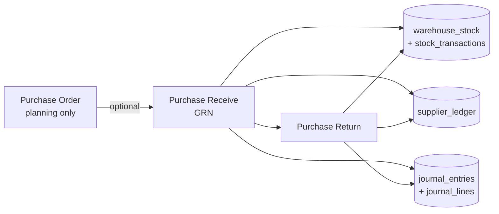

# Purchase Module Reference

**Scope:** Purchase Order (PO) → Purchase Receive (GRN) → Purchase Return, plus supplier sub-ledger, stock, and GL.  
**Last reviewed:** June 2026 (codebase audit of controllers, models, views, JS, `JournalPostingService`, `PurchaseAuditModel`).

This document answers three questions:

1. **UI** — Is the experience consistent, modern, and mobile-friendly?
2. **Stock / ledger / GL** — What happens on create, update, delete/cancel, and reverse for supplier, warehouse, branch, and accounts?
3. **Database integrity** — How are constraints and audit trails enforced?

For implementation history and phase tasks, see [PURCHASE_MODULE_MODERNIZATION_PLAN.md](./PURCHASE_MODULE_MODERNIZATION_PLAN.md).  
For **live** integrity checks, open **`PurchaseAudit/checklist`** (UI) or `PurchaseAudit/run_checks` (JSON). Logic: `PurchaseAuditModel::runHealthChecks()`.

---

## 1. Module map

| Layer | Purchase Order | Purchase Receive (GRN) | Purchase Return |
|--------|----------------|------------------------|-----------------|
| Controller | `PurchaseOrderController` | `PurchaseReceiveController` | `PurchaseReturnController` |
| Model | `PurchaseOrderModel` | `PurchaseReceiveModel` (extends `Helper`) | `PurchaseReturnModel` |
| Index view | `app/views/PurchaseOrder/index.php` | `app/views/PurchaseReceive/index.php` | `app/views/PurchaseReturn/index.php` |
| Create | `create.php` + `PurchaseOrder.js` | `create.php` + `PurchaseReceive.js` | `create.php`, offcanvas partial, `PurchaseReturn.js` |
| Other | `edit.php`, `details.php`, `audit.php` | `details.php`, `audit.php` | `slip.php`, `audit.php` |
| Index JS | `purchase-order-index.js` | `purchase-receive-index.js` | `purchase-return-index.js` |
| Shared CSS | `purchase-index.css` (PO indigo, GRN green, Return orange variants) | same | `purchase-return-index.css`, `purchase-return-create.css` |

**Ecosystem checklist:** `app/models/PurchaseAuditModel.php` — automated SQL checks + reference rules for products, suppliers, warehouses, stock SSOT, PO, GRN, returns, supplier payments, ledger, reports.

**Related (outside this folder):**

- **Supplier master:** `supplier/*`
- **Supplier payments / AP settlement:** `SupplierTransaction` + `JournalPostingService::postSupplierTransactionJournal`
- **Reports:** `Report/PurchaseHistory`, `PurchaseReturnHistory`, `SupplierWisePurchase`

---

## 2. End-to-end workflow



**Golden rules (from `PurchaseAuditModel`):**

- **PO alone** does not move stock, supplier payable, or GL.
- **GRN** is the economic event: stock IN, AP credit (GL + supplier sub-ledger).
- **Purchase return** reduces stock (Good only), reduces AP, caps by GRN `returnable_qty` and warehouse availability.
- **Stock writes** go only through `StockTransactionModel` (`updateWarehouseStock` + `logMovement`), never direct `UPDATE warehouse_stock` in purchase code.

---

## 3. UI consistency and mobile experience

### 3.1 Shared design system

All three index pages follow the same **modern procurement shell**:

| Pattern | Implementation |
|---------|----------------|
| Hero header | Gradient banner, title, subtitle, branch tag, primary actions |
| Filters | Collapsible panel: date presets (today / yesterday / week / month / custom), status chips, smart search |
| Results | DataTables server-side + **mobile card view** via `sales-dt-mobile.css` / `sales-dt-mobile-controls` |
| Theming | `purchase-index.css` — PO (indigo), GRN (green `.purch-grn`), Return (orange `.purch-rtn`) |
| Security | CSRF on POST/AJAX (`csrf_token` in forms and `window.CSRF_TOKEN` / boot objects) |
| Audit entry | Links to module `audit` pages and `PurchaseAudit/checklist` |

**Purchase Return** is the most aligned with Sales Return UX: branch tag, live status chip counts (`return_filter_summary`), offcanvas quick-create, full-page create link, smart sort (active before reversed).

**Purchase Order / Receive** use the shared `purch-index-*` layout; Return adds Sales-module-style chips and offcanvas (closer to `SalesReturn`).

### 3.2 Screen-by-screen

| Screen | UX notes |
|--------|----------|
| **PO index** | Server-side table, filter bar, cancelled toggle (`?cancelled=1`), cancel with reason (SweetAlert), view details, draft delete |
| **PO create / edit** | Card workspace, product search AJAX, line grid, totals — edit **draft only** |
| **PO details** | Read-only header + lines + status badges |
| **GRN index** | Same as PO; optional `?returned=1` mode label (returned GRNs view) |
| **GRN create** | **From PO** or **direct purchase** (no PO); per-line warehouse required; loads PO lines via `get_po_details` |
| **GRN details** | Line list, supplier, PO link, cancel action (if exposed in UI) |
| **Return index** | Status chips (all / active / reversed), reverse via AJAX + reason (no dedicated reverse page — unlike Sales Return) |
| **Return create** | Search GRN by code → load returnable lines → warehouse dropdown with **available qty** (SSOT) → Good/Damage |
| **Return slip** | Print-oriented slip |
| **Audit pages** | Per-module `UserAudit` logs filtered by action prefix (`purchase_order_`, `purchase_receive_`, `purchase_return_`) |

### 3.3 Mobile-friendly behavior

- **&lt; 768px:** DataTables rows render as **stacked cards** (drawCallback in index JS).
- Touch-friendly chips, collapsible filters, full-width buttons in hero actions.
- Return: offcanvas create on phone; desktop can open full `PurchaseReturn/create`.

### 3.4 UI gaps / inconsistencies (documented)

| Item | Severity | Notes |
|------|----------|-------|
| `PurchaseAudit/checklist` view | Medium | Controller + model exist; **view file** `app/views/PurchaseAudit/checklist.php` not present in repo — links from indexes will 404 until added (mirror sales audit checklist + `purchase-audit-checklist.css`). |
| Return reverse UX | Low | AJAX-only from list; no full-page reverse confirmation like Sales Return (stock preview, “what will happen”). |
| Branch on list filters | Low | PO/GRN/Return datatables filter by date/search/status but **do not consistently filter** `WHERE branch_id = session` on PO/GRN lists (Return summary same). Writes still stamp `$_SESSION['branch_id']`. |
| PO status after create | Low | New POs saved as **`draft`**; confirm whether business expects `pending` before receive. |

---

## 4. Stock, supplier ledger, and GL by operation

### 4.1 Legend

| Symbol | Meaning |
|--------|---------|
| — | No effect |
| ✓ | Effect applied in same DB transaction |
| Sub | `supplier_ledger` sub-ledger (running balance per supplier) |
| GL | `journal_entries` via `JournalPostingService` |
| STK | `warehouse_stock` + `stock_transactions` |

**Stock reference types (purchase):**

- `purchase_receive` — GRN IN  
- `purchase_receive_cancel` — GRN cancel OUT  
- `purchase_return` — return OUT (Good)  
- `purchase_return_reversal` — undo return IN  

### 4.2 Purchase Order

| Operation | Stock | Supplier ledger | GL | Branch | Supplier | Warehouse |
|-----------|-------|-----------------|-----|--------|----------|-----------|
| **Create** | — | — | — | `branch_id` from session on header | Required active supplier | — |
| **Update** (draft only) | — | — | — | Unchanged on header | Can change | — |
| **Cancel** (draft/pending + reason) | — | — | — | — | — | — |
| **Hard delete** (draft only) | — | — | — | — | — | — |
| **Receive against PO** | — (GRN does stock) | — | — | — | — | — |

**Status lifecycle:** `draft` → (optional) `pending` → `partially_received` / `received` via GRN `updatePOStatus()`, or `cancelled`.

**PO line integrity:** `purchase_order_items.received_qty` updated from sum of `purchase_receive_items` linked to PO lines; audit check: `received_qty ≤ qty`.

### 4.3 Purchase Receive (GRN)

| Operation | Stock | Supplier ledger | GL | Branch | Supplier | Warehouse |
|-----------|-------|-----------------|-----|--------|----------|-----------|
| **Create** (PO or direct) | ✓ STK IN at line rate (moving avg) | ✓ **Credit** AP (`reference_type` `purchase`) | ✓ **Dr Inventory / Cr Supplier Payable** (`postPurchaseReceive`) | Header `branch_id` | Required (from PO or direct form) | **Required per line**; branch warehouses via `Get_Warehouse_By_Branch` |
| **Update** | — | — | — | — | — | Not supported after post |
| **Cancel** (`cancelReceive`) | ✓ STK OUT (`purchase_receive_cancel`) | — **No compensating sub-ledger row** | ✓ `reverseLinkedJournal` if `journal_entry_id` set | — | — | Uses original line warehouses |
| **Delete** | — | — | — | — | — | No hard delete of posted GRN |

**Create transaction order (single `beginTransaction`):**

1. Insert `purchase_receives` + `purchase_receive_items`  
2. Per line: `updateWarehouseStock(+qty, rate)` + `logMovement(purchase_receive)`  
3. If PO-based: `updatePOStatus(po_id)`  
4. `postPurchaseReceive` → save `journal_entry_id`  
5. `supplier_ledger` credit for `total_amount`  
6. `commit`

**Cancel guards:**

- Status not `cancelled` / `returned`  
- No active (`is_reversed = 0`) `purchase_returns` on that GRN  
- Does not decrement `purchase_order_items.received_qty` (integrity gap if PO was partially received — see §5)

### 4.4 Purchase Return

| Operation | Stock | Supplier ledger | GL | Branch | Supplier | Warehouse |
|-----------|-------|-----------------|-----|--------|----------|-----------|
| **Create** | ✓ Good: STK OUT at **current moving avg**; Damage: log only (qty 0) | ✓ **Debit** AP (`reference_type` `return`) | ✓ **Dr Supplier Payable / Cr Inventory** (`postPurchaseReturn`) | `$_SESSION['branch_id']` on header | From GRN | Required for Good; validated vs `Get_Warehouse_Wise_Product_Stock` |
| **Update** | — | — | — | — | — | Not supported |
| **Reverse** (`reversePurchaseReturn`) | ✓ IN via `purchase_return_reversal` from logged OUT rows | **Intended** credit to restore owing — see §5 bug | ✓ `reverseLinkedJournal` | — | — | Restores at movement rate |
| **Delete** | — | — | — | — | — | Not exposed |

**Create guards:**

- `return_qty ≤ (qty - returned_qty)` on `purchase_receive_items`  
- Good: `return_qty ≤ warehouse available` (SSOT, not GRN returnable alone)  
- Increments `purchase_receive_items.returned_qty`  

**Reverse guards:**

- `is_reversed = 0`  
- Rolls back `returned_qty` on GRN lines  
- Stock restore driven by `stock_transactions` reference `purchase_return`  

### 4.5 Supplier payments (context)

GRN/return move **control account** via GL and **supplier_ledger** running balance. Actual cash/bank payments are recorded in **SupplierTransaction** (separate module), which posts its own GL and ledger rows. Purchase audit section `supplier_payments` checks payments have matching ledger rows.

### 4.6 GL posting summary (`JournalPostingService`)

| Event | Debit | Credit |
|-------|-------|--------|
| GRN | Inventory (asset) | Supplier Payable |
| Purchase return | Supplier Payable | Inventory |
| GRN cancel / return reverse | Via `createReversingEntry` on original JE | Swapped lines |

Amounts use document **`total_amount`** on the header (line detail is for stock avg / operational qty).

### 4.7 Warehouse and branch rules

- GRN lines must have `warehouse_id`; audit fails invalid or cross-branch warehouse vs GRN `branch_id`.  
- Return warehouse picker uses **branch of the GRN** (`getReceiveForReturn` loads branch warehouses).  
- Stock availability for returns uses `Helper::Get_Warehouse_Wise_Product_Stock` (physical minus sales pipeline holds — same SSOT as sales).

---

## 5. Database integrity

### 5.1 Transaction boundaries

| Action | Transaction | Rollback on failure |
|--------|-------------|---------------------|
| PO create/update | Yes | Full |
| GRN create | Yes | Stock + GL + ledger not committed |
| GRN cancel | Yes | — |
| Return create | Yes | — |
| Return reverse | Yes | — |

**Rule:** GL posting failure throws inside transaction → entire GRN/return create rolls back.

### 5.2 Key tables and invariants

| Table / field | Invariant |
|---------------|-----------|
| `purchase_order_items.received_qty` | ≤ `qty`; updated from received lines |
| `purchase_receive_items.returned_qty` | ≤ `qty`; incremented on return, decremented on return reverse |
| `purchase_receives.journal_entry_id` | Set on successful receive |
| `purchase_returns.journal_entry_id` | Set on successful return |
| `purchase_returns.is_reversed` | 1 after reverse; paired with `purchase_return_reversal` stock |
| `warehouse_stock.qty` | Should never go negative (audit lists offenders) |
| `stock_transactions` | Every purchase movement should have matching `warehouse_stock` row |

### 5.3 Automated health checks (`PurchaseAuditModel`)

Run via `PurchaseAudit/checklist` or `PurchaseAudit/run_checks` (JSON). Sections include:

- Products on GRN/PO (active, not orphan)  
- Suppliers on GRN/PO/direct purchase  
- Warehouse validity and branch match  
- Stock SSOT and negative qty  
- PO over-receive  
- GRN missing journal or stock IN  
- Cancelled GRN journal reversed  
- Return missing journal/stock OUT, over-returned, reversal flag vs stock  
- Supplier payment ↔ ledger linkage  

### 5.4 Known integrity / accounting gaps

| # | Issue | Status |
|---|--------|--------|
| 1 | GRN cancel — supplier ledger + mark original `purchase` rows reversed | **Fixed** (Phase 6) |
| 2 | GRN cancel — PO `received_qty` via `updatePOStatus` (active GRNs only) | **Fixed** (Phase 6) |
| 3 | Return reverse — supplier ledger before commit | **Fixed** (Phase 6) |
| 4 | List queries omit session branch filter on PO/GRN | Open — Phase 7 |
| 5 | `PurchaseAudit/checklist` view | **Fixed** (Phase 8.1) |
| 6 | GRN cancel stock pre-check before OUT | **Fixed** (Phase 6) |
| 7 | Return reverse — mark original `return` ledger rows `is_reversed` | **Fixed** (Phase 6) |

---

## 6. Security and audit

| Control | Coverage |
|---------|----------|
| CSRF | PO store/update/delete/cancel, GRN store/cancel/get_po_details, Return search/store/reverse |
| Login | `requireLogin()` on all purchase controllers |
| User audit | `UserAudit` on create/update/cancel/reverse with structured JSON (amounts, `journal_entry_id`, accounting notes) |
| Reversal reason | GRN cancel min 5 chars; Return reverse required (POST body) |

---

## 7. Quick reference — “what touches what?”

```
CREATE PO     → DB: purchase_orders, purchase_order_items
UPDATE PO     → DB: same (draft only)
CANCEL PO     → status + cancel metadata
DELETE PO     → hard delete header (draft only)

CREATE GRN    → DB + STK IN + GL (Dr Inv, Cr AP) + supplier_ledger CREDIT + PO received_qty
CANCEL GRN    → STK OUT + GL reverse + status cancelled (see gaps §5.4)

CREATE RETURN → DB + STK OUT (Good) + GL (Dr AP, Cr Inv) + supplier_ledger DEBIT + returned_qty
REVERSE RETURN→ STK IN + GL reverse + is_reversed + returned_qty rollback (+ ledger gap §5.4 #3)
```

---

## 8. Files to read first (developers)

1. `app/models/PurchaseAuditModel.php` — rules + SQL health checks  
2. `app/models/PurchaseReceiveModel.php` — `createReceive`, `cancelReceive`  
3. `app/models/PurchaseReturnModel.php` — `createReturn`, `reversePurchaseReturn`  
4. `app/services/Accounting/JournalPostingService.php` — `postPurchaseReceive`, `postPurchaseReturn`  
5. `app/models/StockTransactionModel.php` — moving average and `logMovement`  
6. `public/assets/css/purchase-index.css` — shared UI tokens  

---

## 9. Related documentation

- [PURCHASE_MODULE_REMAINING_PHASES.md](./PURCHASE_MODULE_REMAINING_PHASES.md) — **remaining work** (Phases 7–15), session-sized tasks and verification gates  
- [PURCHASE_MODULE_MODERNIZATION_PLAN.md](./PURCHASE_MODULE_MODERNIZATION_PLAN.md) — phased rollout and completion status (Phases 1–6)  
- [ACCOUNTING_PROGRESS.md](./ACCOUNTING_PROGRESS.md) — GL ledger natures (`inventory`, `supplier_payable`, etc.)  
- Sales parity: [SALES_MODULE_MODERNIZATION_PLAN.md](./SALES_MODULE_MODERNIZATION_PLAN.md) (returns/reverse UI patterns)

---

*This reference reflects the codebase as audited. Fix gaps in §5.4 in code when prioritizing accounting accuracy.*